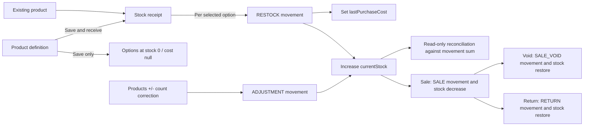

# Inventory logic audit — 2026-09-29

Scope: Inventory frontend, receipt/recovery flows, Product stock corrections and opening cost, legacy Restock, inventory history/reconciliation, Prisma models/migrations, and stock effects from sales, returns, voids, and exchanges. This is an audit only. No application logic, API, migration, or business data was changed.

The audit is source-based. Existing unit/service/browser tests use doubles or intercepted HTTP for the new receipt path. The additive receipt migration has not been executed against PostgreSQL in this workspace, so database findings below take priority over passing mocked tests.

## Executive verdict

The intended inventory model is sound: stock belongs to a color/size option, every business stock change should have a movement, purchased receiving updates stock and current purchase cost atomically, and reconciliation is read-only. Tenant scoping and OWNER/WAREHOUSE cost boundaries are consistently present in the reviewed backend paths.

The new batch-receiving path is **not release-ready**. One P0 database-contract conflict means every receipt that tries to add stock will fail on a real database after the current migrations are applied. Save-only product creation can still succeed because it inserts no RESTOCK movement. The current test suite does not expose this because receipt service tests replace PostgreSQL with an in-memory double that does not enforce existing database constraints.

## What Inventory contains

| Area | What it does | Who can use it | Writes stock/cost? |
| --- | --- | --- | --- |
| Stock & receiving | Lists products, options, active stock and current cost | OWNER and WAREHOUSE; cost hidden from WAREHOUSE | Read-only until an action is chosen |
| New product | Defines product, category, colors, sizes, SKU/barcode, price and optional photo | OWNER and WAREHOUSE | Save-only creates zero stock; OWNER may continue to receiving |
| Batch receiving | Enters quantities across several color/size options with one cost per piece | OWNER | Intended to add stock, set latest cost and create receipt + movements atomically |
| Set opening cost | Assigns a current cost to eligible uncosted legacy/opening inventory | OWNER | Changes current cost only; does not change stock or historical sale snapshots |
| Legacy Restock | Receives one option with quantity, unit cost and optional note | OWNER | Adds stock, updates latest cost and writes one RESTOCK movement |
| Receipt history | Shows purchased delivery batches and their items | OWNER and WAREHOUSE; cost hidden from WAREHOUSE | No |
| Movement history | Shows RESTOCK, SALE, RETURN, SALE_VOID, DAMAGE and ADJUSTMENT ledger rows | OWNER and WAREHOUSE; cost/note hidden from WAREHOUSE | No |
| Stock check | Compares stored stock with the sum of movements | OWNER and WAREHOUSE | No; mismatches are never repaired automatically |
| Products +/- | One-piece physical count correction | OWNER | Writes ADJUSTMENT and changes stock by exactly +1 or -1 |

`DAMAGE` exists as a movement type and history filter, but no reviewed frontend or backend business flow currently creates a damage movement.

## Intended stock lifecycle

An exchange correctly has no special inventory movement type: it is one Return plus a replacement Sale.

## Findings, ordered by priority

### 1. P0 — Batch receiving violates the existing RESTOCK database constraint

The receipt service inserts `InventoryMovement` with type `RESTOCK`, quantity, cost, actor and note, but leaves `idempotencyKey` and `requestFingerprint` null. Migration `20260917110700_prepare_restock_cost_and_idempotency` requires both fields to be non-null for **every** RESTOCK movement. The new receipt migration does not alter that constraint.

Result on real PostgreSQL: the first receipt movement insert violates `InventoryMovement_restock_idempotency_check`. The surrounding transaction rolls back the receipt, all stock increments, cost updates, and new-product creation when creation and receiving are combined. Save-only product creation is unaffected.

Evidence: `backend/src/receipts/receipt.service.ts:44`; `backend/prisma/migrations/20260917110700_prepare_restock_cost_and_idempotency/migration.sql:17`; the new migration contains no compatible constraint change.

Why tests passed: `backend/src/receipts/receipt.test.ts` uses a transaction double whose `inventoryMovement.create` only increments a counter. It does not enforce PostgreSQL CHECK constraints, partial unique indexes, triggers, or foreign keys. Browser tests intercept `/api/inventory/receipts` and also do not touch PostgreSQL.

Recommendation: stop release of the new receiving path until the ledger/idempotency design is made compatible and exercised on disposable PostgreSQL. Preserve receipt-level replay while ensuring every linked movement satisfies the final database contract. Test one-item and multi-item receipts, rollback, replay, same-key/different-payload conflict and concurrent different-key receipts on PostgreSQL.

### 2. P1 — ARCHITECTURE.md still specifies the previous product/opening-stock flow

The source-of-truth architecture still says OWNER product setup uses `/api/products/setup`, creates one opening piece per selected option, and records ADJUSTMENT movements with pending cost. The current frontend sends creation through Inventory and `/api/inventory/product-setups`, normally creating zero stock or a purchased receipt.

Both backend paths remain available for compatibility, so the system currently has two valid creation semantics:

- legacy setup: OWNER options may begin with one uncosted piece;
- Inventory setup: options begin at zero unless included in a purchased receipt.

This is a documentation and operational-governance conflict. A future developer or older client can legitimately follow the architectural source of truth and create different opening stock than the current UI.

Evidence: `ARCHITECTURE.md` Product Model section; `backend/src/products/product.service.ts:261`; `backend/src/receipts/receipt.service.ts:67`; `frontend/src/pages/app/InventoryPage.jsx`.

Recommendation: after the P0 behavior is resolved, update the architecture to name the canonical creation path and explicitly define the legacy compatibility boundary and retirement policy.

### 3. P1 — Receipt history does not preserve product, option, or actor identity snapshots

Receipt items preserve quantity and unit cost, but history reads the **current** Product name, Variant SKU/color/size, and User name through live relations. Editing a product, color, size, SKU, or user name changes how an old receipt appears. The financial amount remains stable, but the visible identity of what was received does not.

This weakens receipt history as audit evidence and can make an old delivery look as if it contained a newly renamed option.

Evidence: `backend/prisma/schema.prisma` StockReceipt/StockReceiptItem models; live relation include and `view()` in `backend/src/receipts/receipt.service.ts:10-16`.

Recommendation: decide whether a stock receipt is operational history or formal purchasing evidence. If it is evidence, store immutable product name, SKU, color, size, and actor display snapshots at receipt time. Do not rewrite existing receipts when catalog labels change.

### 4. P1 — Receipt recovery does not normalize authentication/account-state failures

The generic API client returns a 401/403 error result, but `submitReceipt` does not map it to `requiresLogin` or `requiresAccountReview`, unlike the existing Restock and inventory-audit flows. `StockReceiptForm` and the page-level retry therefore preserve the operation and show a receiving error instead of redirecting to the appropriate auth/account screen.

Because any pending receipt disables new product/receiving actions, an expired session or inactive account can leave Inventory blocked until the broader application shell reloads or the user manually navigates away.

Evidence: `frontend/src/features/inventory/stock-receipt-flow.js:46-51`; `frontend/src/features/inventory/StockReceiptForm.jsx:49-58`; `frontend/src/pages/app/InventoryPage.jsx:95-106`. Correct comparison: `frontend/src/features/inventory/restock-flow.js:56-60`.

Recommendation: map confirmed auth/account states consistently before classifying receipt recovery. Preserve the original request, then route the user appropriately; after authentication/account restoration, retry the same operation key and frozen payload.

### 5. P1 — Safe replay depends entirely on one browser's local storage

Before sending, the frontend stores the frozen request and UUID in localStorage and coordinates tabs with Web Locks. This protects reloads in the same browser. If storage is cleared, corrupted, unavailable, or the user switches device after the server committed but before the response arrived, the operation identity is lost. The user can submit a new receipt with a new key and duplicate the delivery.

The backend has an operation lookup endpoint, but recovery still requires knowing the lost UUID. Receipt history can help a human investigate, yet the receiving form does not automatically reconcile an uncertain operation from server history.

Evidence: `frontend/src/app/operation-recovery.js`; `frontend/src/features/inventory/stock-receipt-recovery.js`; `backend/src/receipts/receipt.routes.ts:34`.

Recommendation: retain the current browser recovery, but document its boundary and add a server-assisted reconciliation strategy before claiming crash/device-safe exactly-once UX. Never silently discard an uncertain request.

### 6. P1 — Some terminal failures can preserve a blocking recovery forever

The client settles pending records for HTTP 422 and a selected list of domain codes. `PRODUCT_NOT_FOUND` and `VARIANT_NOT_FOUND` are terminal for the submitted frozen receipt but are not in that rejection list. Other durable 4xx cases can also remain neither rejected nor retryable. Retrying repeats the same terminal result while the pending record blocks every new receiving operation.

Evidence: rejection classification in `frontend/src/features/inventory/stock-receipt-flow.js:47-49`; global blocking through `pending.length > 0` in `frontend/src/pages/app/InventoryPage.jsx`.

Recommendation: define a complete outcome table by HTTP status and domain code: committed/replay, confirmed rejection and safe release, authentication pause, conflict requiring original-operation review, and genuinely uncertain transport/server outcome. Test every branch.

### 7. P2 — Receipt records are not protected as append-only history at database level

InventoryMovement has an append-only database trigger. StockReceipt and StockReceiptItem have restrictive foreign keys and no mutation API, but the migration adds no trigger preventing UPDATE/DELETE. It also does not enforce that receipt item quantity/cost equal the linked movement's quantityChange/unitCost.

Application code creates matching values inside one transaction, so normal API use is consistent. The database does not independently preserve the receipt as immutable evidence if a future code path or privileged maintenance statement changes it.

Evidence: append-only movement trigger in `20260915160000_add_sale_return_void_exchange_lifecycle/migration.sql:625`; receipt DDL in `20260929190000_stock_receipts/migration.sql`.

Recommendation: if receipts are audit records, add reviewed database invariants/immutability after resolving P0. Avoid constraints that make transactional creation impossible; validate the final SQL on PostgreSQL.

### 8. P2 — Large receipts execute hundreds of sequential database statements

A receipt supports up to 200 options. For every option the service performs one Variant update, one InventoryMovement insert, and one StockReceiptItem insert sequentially: up to 600 statements, plus locks and final reads, inside a 15-second transaction.

Correctness is atomic, but latency and timeout risk grow linearly. A timeout rolls everything back, yet the client correctly treats server/transport failure as uncertain and forces replay, which can look slow or stuck to the user.

Evidence: loop in `backend/src/receipts/receipt.service.ts:41-48`; transaction timeout at lines 58 and 87.

Recommendation: benchmark realistic 24-, 100-, and 200-option receipts on staging PostgreSQL before a speed claim. If needed, replace per-item round trips with bounded set-based SQL while preserving locks, tenant constraints, receipt-item links and movement history.

### 9. P2 — Receipt history uses offset pagination and can shift under new inserts

Movement history uses a stable `(createdAt, id)` cursor. Receipt history uses `skip=(page-1)*20`. If a new receipt is inserted while a user moves between pages, rows can duplicate or be skipped.

Evidence: `backend/src/receipts/receipt.service.ts:89-91`.

Recommendation: use the same stable cursor principle as movement history, ordered by `createdAt DESC, id DESC`.

### 10. P2 — History and stock-check filters only expose products on the current catalog page

The backend accepts tenant-scoped Product/Variant IDs and can query any owned record. The frontend filter choices come from `state.products`, which is only the current Inventory product page. A user cannot select an off-page product in Movement history or Stock check without returning to Stock & receiving, searching/paging, then coming back.

Evidence: `products={state.kind === 'ready' ? state.products : []}` in `InventoryPage.jsx`; `ProductVariantFilters` in `InventoryAuditSections.jsx`.

Recommendation: load a bounded filter-search source independent from the current stock page, or allow direct product search within those views.

### 11. P2 — Inventory list payload size is bounded by products, not options

Inventory needs option-level stock and cost, so it requests complete Variant arrays for every product on the page. Products can gain more options after initial creation; option payload size is not independently paginated. This affects list render time, movement-filter choices, and initial receiving setup.

Evidence: Inventory calls `listProducts` without summary mode; Products service returns full variants. The initial request limit of 200 does not permanently cap later option growth.

Recommendation: measure actual payloads. If stores can accumulate large option sets, return compact product summaries first and fetch one selected product's options for receiving/details.

### 12. P3 — Legacy Restock and batch receiving overlap operationally

Both are OWNER-only purchase flows, both create RESTOCK movements, both update latest purchase cost, and both can receive one option. The legacy flow also supports a free-text note and durable movement-level idempotency; the batch flow creates a receipt and uses one shared cost.

The overlap is currently intentional for compatibility, but it creates two places to record the same delivery with different history structures.

Recommendation: keep legacy behavior stable for existing clients, but establish one primary UI path and a clear deprecation/exception rule. A free-text receipt reference or supplier/invoice model is outside the current contract and should not be invented silently.

## Logic that is working well

- Account ID and actor ID come from authenticated tenant context, never the receipt body.
- OWNER-only receiving and cost mutation are enforced in backend routes/services; WAREHOUSE receipt history omits cost fields.
- Product and Variant rows are locked in consistent order before stock changes.
- Receipt items are unique per option, positive, bounded, and tenant/product linked through composite foreign keys.
- Batch receiving is designed as one transaction: receipt, stock, latest cost, movements and receipt items roll back together.
- Same receipt key/payload replays; same key/different payload conflicts.
- A receipt updates current cost without rewriting historical SaleItem cost snapshots.
- Sales prevent negative stock and write SALE movements atomically.
- Returns and sale voids restore the original historical cost basis through RETURN/SALE_VOID movements.
- Exchanges correctly compose Return + new Sale.
- Product +/- corrections are exactly one piece, OWNER-only, idempotent and recorded as ADJUSTMENT.
- Opening-cost initialization changes no quantity and intentionally leaves historical unknown sale costs unchanged.
- Stock reconciliation is read-only and uses Repeatable Read for its two-query unfiltered path; status filtering computes before LIMIT in one SQL statement.
- Movement pagination is cursor-based and tenant scoped.

## Role behavior

### OWNER

Can create definitions, receive purchased stock, use legacy one-option Restock, set eligible pending opening cost, correct counts in Products, and view costs/notes/receipt totals.

### WAREHOUSE

Can create a zero-stock product definition and read stock, receipt history, movement history and reconciliation. Cannot submit receipts, Restock, set cost, or receive cost/note fields. These limits are backend-enforced, not only hidden in UI.

### SUPER_ADMIN

Does not enter tenant Inventory through these routes. Tenant middleware requires an active Account and OWNER/WAREHOUSE role.

## Data and accounting meaning

- `currentStock` is the fast current quantity on ProductVariant.
- InventoryMovement is the evidence explaining every supported stock change.
- `lastPurchaseCost` is the latest/current cost basis, not average cost and not total invoice cost.
- StockReceipt groups one purchased delivery for one Product.
- One receipt currently has one purchase cost per piece shared across selected options.
- Receipt total is the exact sum of item quantity × item unit cost at four decimals.
- A Sale snapshots current cost into SaleItem; null remains unknown rather than becoming zero.
- Later receiving or opening-cost entry never rewrites historical sales.
- Reconciliation reports `storedStock - movementSum`; it does not repair data.

## Recommended implementation order

1. Block deployment and resolve the P0 RESTOCK constraint incompatibility.
2. Add a real PostgreSQL migration/execution test for one-item and multi-item receipts, rollback and replay.
3. Align ARCHITECTURE.md with the chosen canonical product/receiving flow.
4. Complete the frontend recovery outcome table for auth, terminal rejection, conflict and uncertainty.
5. Decide and implement immutable receipt identity snapshots if receipt history is audit evidence.
6. Harden receipt immutability/link invariants and move receipt pagination to a cursor.
7. Measure transaction and payload performance before optimizing.
8. Simplify/deprecate the overlapping legacy Restock UI only after compatibility requirements are explicit.

## Validation and limits

- Reviewed `ARCHITECTURE.md`, Prisma schema and all Inventory/receipt/restock frontend/backend paths.
- Cross-checked stock mutations in Products, Sales, Returns, Sale Void and Exchange.
- Confirmed the P0 conflict statically against the ordered migration SQL and receipt insert.
- Current backend validation: 437/437 tests passed; TypeScript/Prisma production build passed; Prisma schema validation passed; `git diff --check` passed.
- Existing prior frontend validation in this working tree: unit 250/250, browser 73/73, ESLint and Vite build passed.
- No migration was applied, no live authenticated mutation was sent, and no production/staging database was accessed.
- Passing double/mock tests do not validate PostgreSQL CHECK constraints, triggers, lock behavior or transaction latency.

## Git and change boundary

This audit adds only `docs/inventory-logic-audit-2026-09-29.md`. Existing uncommitted application and migration changes were already present from the earlier Inventory implementation. No UI code, backend code, Prisma schema/migration, data, commit, deployment, or protected PDF was changed by this audit.
